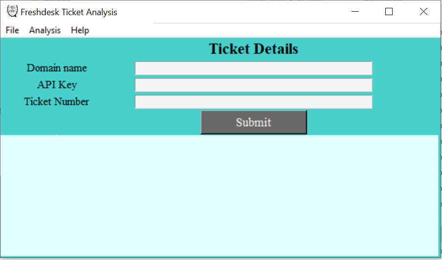
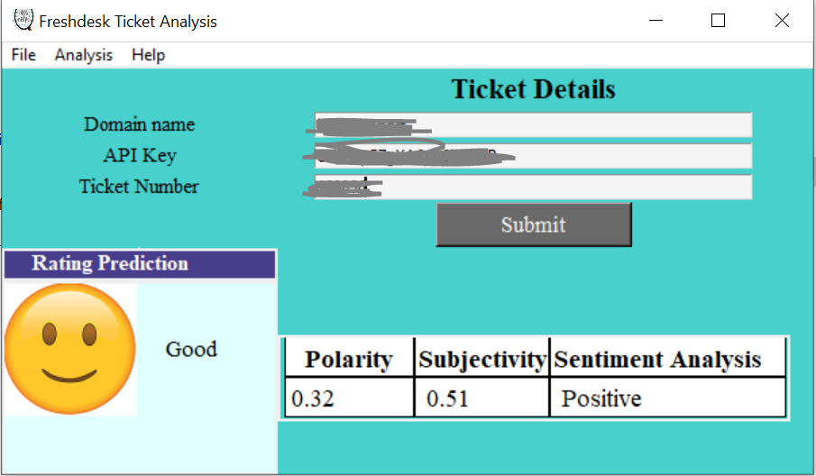

## Ticket-Sentiment-Analysis

<b>INTRODUCTION</b>:- Freshdesk is a customer support platform in which customer can raise tickets related to issue/queries. Sentiments of ticket conversation is important and it shows the customer satisfaction. Based on polarity and subjectivity we can predict, till some extend, what rating customer will give(good, average and poor). It is a desktop application which can predict the customer rating of Freshdesk Ticket.

<b>After Running</b> -

### Programming languages and Library
1. Python
2. Tkinter Library
3. TextBlob Library
4. NLTK Library
5. Pandas Library

<b>MENU OPTIONS</b>:- Below are some available menu options -
 1. <b>FILE</b> - There is only one option 'Exit' under File Menu. This option will close the application.
 2. <b>ANALYSIS</b> - Under this menu there are two options available 'Text Analysis' and 'Fetch Ticket Details'. Only one option can be selected out of both options. Text Analysis will analysis the ticket, it will display polarity and subjectivity of freshdesk ticket and it will analyze the sentiment of ticket. Based on polarity and subjectivity it will try to predict the rating which customer may rate. It will try to predict the rating out of three customer choices good, average and poor. Also if we mark option 'Fetch Ticket Details' then it will fetch all the ticket details about the ticket which we want to analyze from freshdesk api. 
 3. <b>HELP</b> - there is only one about option available which will give info about the packages used in this application and the developer contact details in case of any concern.

<b>MAIN WINDOW FORM</b>:- In the main window of this application there is one form gets display in which user can enter the ticket id and freshdesk user information. There are four textboxes/fields, one field asks to enter freshdesk user id, another field asks to enter freshdesk domain name and there are two other fields in which we need to pass Freshdesk user api id and ticket id. User can get freshdesk user id and api id from his/her freshdesk account. In case of any confusion how to find user id,api key or domain name, user can contact to freshdesk support team or user can check his/her profile setting page of freshdesk portal. 

<b>PROCESS</b>:- User can fill the form and enter ticket id and freshdesk user profile information. After entering these details user need to make sure whether he wants to fetch basic information or not of ticket before analyzing it. If user wants to first fetch basic information(creation date, resolved date, ticket title, customer name etc.) then user can first mark Analysis->'Fetch ticket details' option and then user can click on submit button. So now application will pull out ticket basic information and will put in tabular format in main window. After checking basic information user can mark on Analysis->'Text Analysis' option and then click on Submit button. After few seconds of processing application will analyse the ticket and will display the analysis information in main window. After analysis we can see whether sentiment of freshdesk ticket is good or bad, also we can see what customer may have predict for this ticket.

In case of any concern user can contact to email id piyush.chanchal@hotmail.com.
